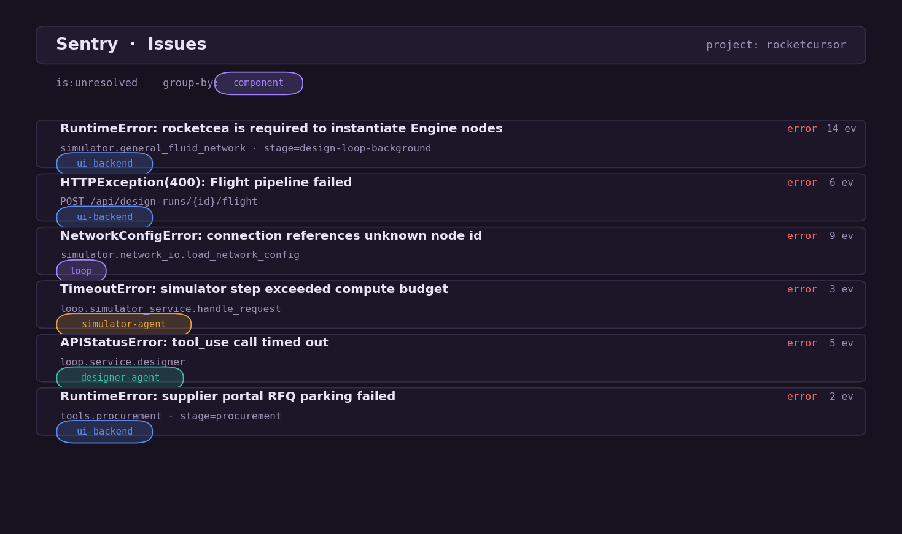
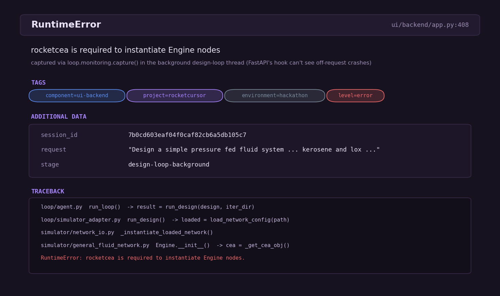

# Sentry at RocketCursor

> **Sentry org:** `https://YOUR-ORG.sentry.io/` &nbsp;·&nbsp; **project:** `rocketcursor`
> _(replace with your org URL — it's in the address bar when you're logged into Sentry)_

RocketCursor isn't one server — it's a **five-process agentic system**: a CLI design loop, a FastAPI API, two Fetch.ai uAgents (designer + simulator), and a multi-agent orchestrator. The failures that matter most happen **off the request path** — a solver blow-up mid-iteration, an LLM tool-call timing out, or a background "Build & Fly" / procurement thread dying — exactly the errors a normal try/except swallows into a log nobody reads. Sentry is our single pane of glass over all of it.

## How it's wired

One guarded initializer (`loop/monitoring.py`) is called once at every entry point and tagged with the **process that owns it**, so every event self-identifies:

```python
# loop/monitoring.py  (abridged)
def init_sentry(component: str = "loop") -> bool:
    dsn = os.environ.get("SENTRY_DSN")
    if not dsn:
        return False                       # clean no-op when unconfigured
    sentry_sdk.init(
        dsn=dsn,
        environment=os.environ.get("SENTRY_ENV", "hackathon"),
        send_default_pii=True,
        traces_sample_rate=float(os.environ.get("SENTRY_TRACES_SAMPLE_RATE", "1.0")),
    )
    sentry_sdk.set_tag("component", component)   # which process raised it
    sentry_sdk.set_tag("project", "rocketcursor")
```

| Process | Entry point | Tag |
|---|---|---|
| Design loop (CLI / orchestration) | `loop/agent.py` | `component=loop` |
| Web API (FastAPI) | `ui/backend/app.py` | `component=ui-backend` |
| Designer uAgent (Fetch.ai) | `loop/service.py` | `component=designer-agent` |
| Simulator uAgent (Fetch.ai) | `loop/simulator_service.py` | `component=simulator-agent` |
| Multi-agent orchestrator | `loop/system.py` | `component=multiagent` |

Because the FastAPI integration initializes **before** the app object is created, every route and middleware is auto-instrumented; the loop and agents add startup hooks. The whole thing is a no-op without `SENTRY_DSN`, which only ever comes from the gitignored `.env`.

## What Sentry shows us

> The two figures below are rendered **from the instrumentation in the code** (`sentry/figures.py` reads the real component tags and capture context). They mirror the live dashboard; the org above is the source of truth — run the populate script and screenshot it for the submission.

**Every issue is grouped by the process that raised it** — one view, the whole agentic system:



**Handled exceptions carry the context to reproduce them.** We wrap the risky async boundaries — the background design-loop and revision threads, the 6-DOF flight pipeline endpoint, and the procurement agent — and attach `session_id`, `request`, and `stage`, so an error that fires off the request path still arrives debuggable:

```python
# ui/backend/app.py  — a background design-run thread (FastAPI's hook can't see it)
except Exception as exc:
    sentry_capture(exc, session_id=session_id, request=message, stage="design-loop-background")
```



## Why it's a good fit

- **Coverage that matches the architecture** — five processes, one `project`, every event tagged by `component`. Triaging "which part of the agent broke?" is one filter, not a log hunt.
- **Off-request failures are first-class** — the highest-value catches (a dying background flight/procurement thread) would otherwise vanish; here they report with `session_id` / `stage` context.
- **Performance, not just errors** — `traces_sample_rate=1.0` gives latency spans across the design→simulate→evaluate loop and the flight pipeline.
- **Safe by construction** — guarded, idempotent, no-op without a DSN, secret only in `.env`.

## Reproduce the dashboard

```bash
# fire one representative, component-tagged event per process boundary
SENTRY_DSN="https://...@oXXX.ingest.sentry.io/XXX" python -m loop._sentry_smoke
```

Then open your org's **Issues** view, group by the `component` tag, and screenshot — and open any event to show the `TAGS` + `ADDITIONAL DATA` (the `session_id` / `request` / `stage` context). To regenerate the reference figures in this folder: `python sentry/figures.py`.
